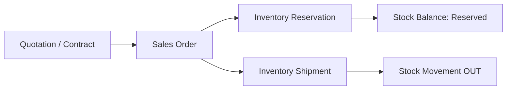
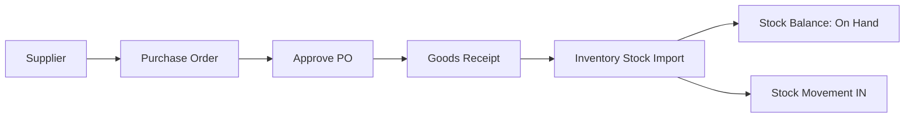

# Tenant Workflow

Tài liệu này mô tả workflow đang có trong tenant workspace sau Phase 3. Mục tiêu là giúp dev/AI agent hiểu luồng nghiệp vụ xuyên service mà không phải đọc từng màn riêng lẻ.

## Runtime access model

1. User đăng nhập web-tenant bằng Google, email/password hoặc tenant code + username/password.
2. Tenant context được lấy từ Tenant Service và lưu trong tenant session.
3. Menu module chỉ hiện khi tenant đã bật module tương ứng.
4. Menu/action trong module chỉ hiện khi Permission Service cấp quyền cho role scoped theo tenant.
5. Business services nhận `TenantId` trong request/query/header và chỉ thao tác data thuộc tenant đó.

## Module visibility

| Module | Route | Permission chính | Trạng thái |
| --- | --- | --- | --- |
| CRM | `/crm/*` | `Nexus.Crm.*` | Đã có enterprise flow nền tảng |
| Sales | `/sales/orders` | `Nexus.Sales.Orders.*` | Đã nối CRM và Inventory |
| Inventory | `/inventory` | `Nexus.Inventory.*` | Đã có product, warehouse, stock balance |
| Purchase | `/purchase` | `Nexus.Purchase.*` | Đã có supplier, PO, goods receipt |

## CRM to Sales

1. User mở Quotation hoặc Contract detail.
2. Action tạo Sales Order prefill customer, source document, dòng hàng, discount và tax.
3. Sales Order lưu `SourceType`, `SourceId`, `SourceNo` để trace ngược về CRM.
4. User tạo Sales Order với một hoặc nhiều dòng hàng, mỗi dòng có warehouse riêng.
5. Approve Sales Order gọi Inventory reservation theo source `SALES_ORDER`.
6. Deliver hoặc Complete Sales Order gọi Inventory shipment, giảm reserved và on hand.

## Inventory

Inventory là service sở hữu tồn kho.

- Product catalog: SKU, name, unit, category, price, tax, active state.
- Warehouse catalog: warehouse code, name, location, active state.
- Stock balance: on hand, reserved, available.
- Reservation: giữ hàng theo source document và warehouse/product line.
- Shipment: xuất hàng từ reservation.
- Manual import: nhập kho nhanh từ UI Inventory.

Không service nào join trực tiếp database Inventory. Sales và Purchase cập nhật tồn qua API Inventory.

## Purchase to Inventory

1. User tạo hoặc chọn Supplier trong `/purchase`.
2. User tạo Purchase Order với một hoặc nhiều dòng hàng, mỗi dòng có warehouse.
3. Approve PO chuyển trạng thái sang `Approved`.
4. Receive PO tạo Goods Receipt.
5. Purchase Service gọi Inventory `POST /api/inventory/stock/import` cho từng dòng receipt.
6. Inventory tạo stock movement `IN` với source `PURCHASE_RECEIPT` và tăng on hand đúng warehouse/product.

## Current document trace

| Source | Target | Trace fields |
| --- | --- | --- |
| Quotation | Sales Order | `SourceType=quotation`, `SourceId`, `SourceNo` |
| Contract | Sales Order | `SourceType=contract`, `SourceId`, `SourceNo` |
| Sales Order | Inventory Reservation/Shipment | `SourceType=SALES_ORDER`, `SourceId=SalesOrder.Id`, `SourceNo=OrderNo` |
| Goods Receipt | Inventory Import | `SourceType=PURCHASE_RECEIPT`, `SourceId=GoodsReceipt.Id`, `SourceNo=ReceiptNo` |

## Operational scenario

1. Bật modules `CRM`, `SALES`, `INVENTORY`, `PURCHASE` cho tenant.
2. Cấp quyền tenant role:
   - `Nexus.Crm.*`
   - `Nexus.Sales.Orders.*`
   - `Nexus.Inventory.*`
   - `Nexus.Purchase.*`
3. Tạo product và warehouse trong Inventory hoặc để Inventory tự tạo catalog khi nhập kho.
4. Tạo supplier và PO trong Purchase.
5. Approve và Receive PO để tăng tồn kho.
6. Tạo Quotation/Contract trong CRM.
7. Tạo Sales Order từ Quotation/Contract.
8. Approve Sales Order để giữ tồn kho.
9. Deliver hoặc Complete Sales Order để xuất kho.

## Next workflow targets

- Sales Order -> Invoice -> Receivable.
- Purchase Goods Receipt -> Supplier Invoice -> Payable.
- Accounting posting từ Sales, Purchase, Invoice và Payment để phase cuối sau khi vận hành CRM/Sales/Inventory/Purchase ổn định.
- Product detail có tồn kho theo warehouse và lịch sử stock movement.
